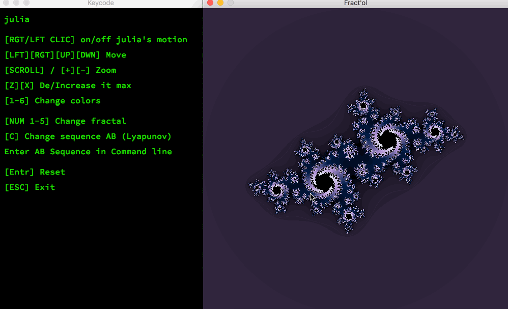
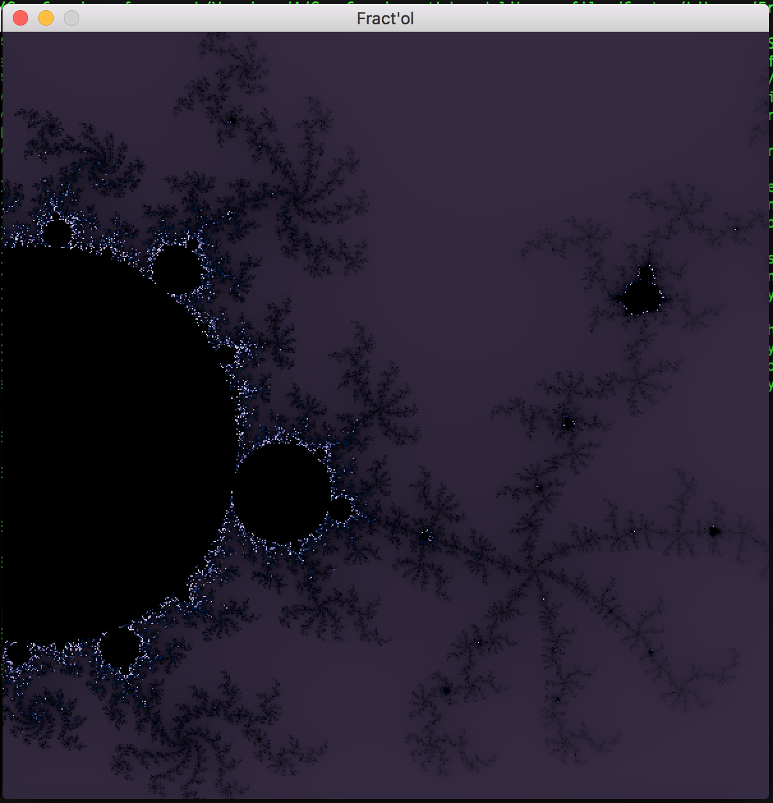
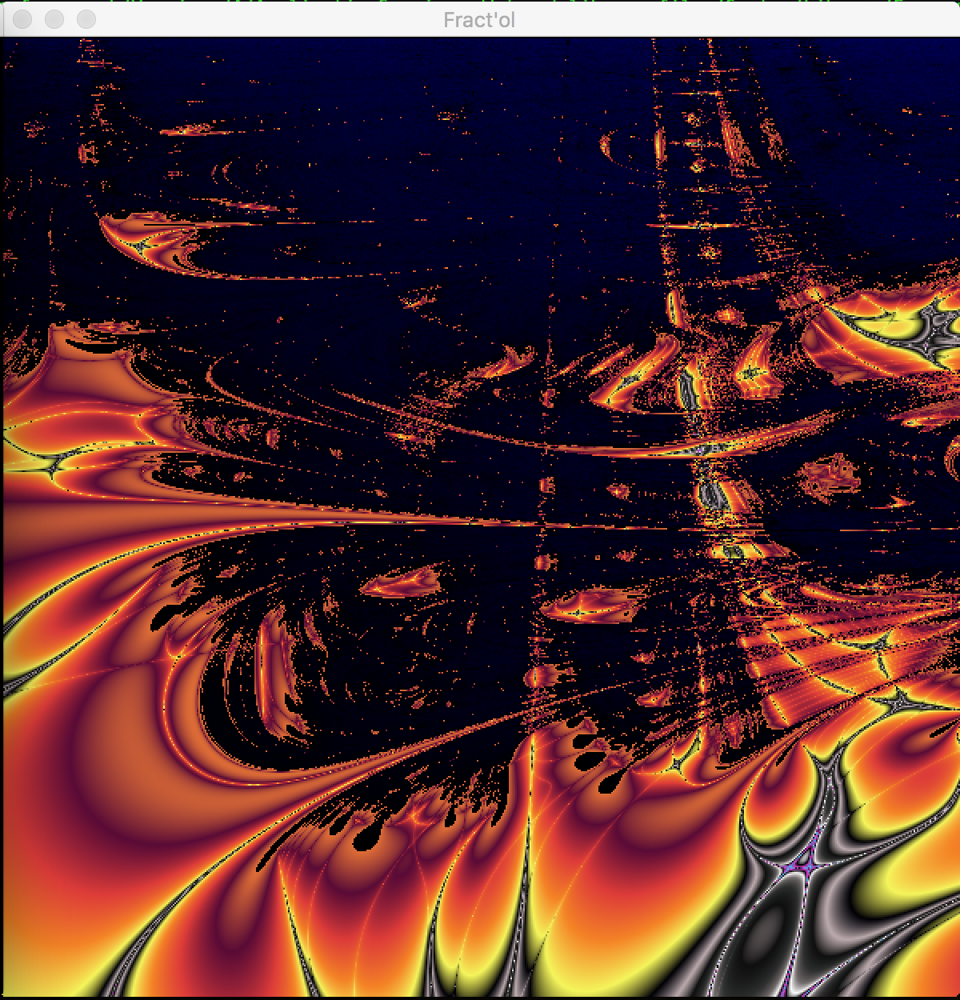
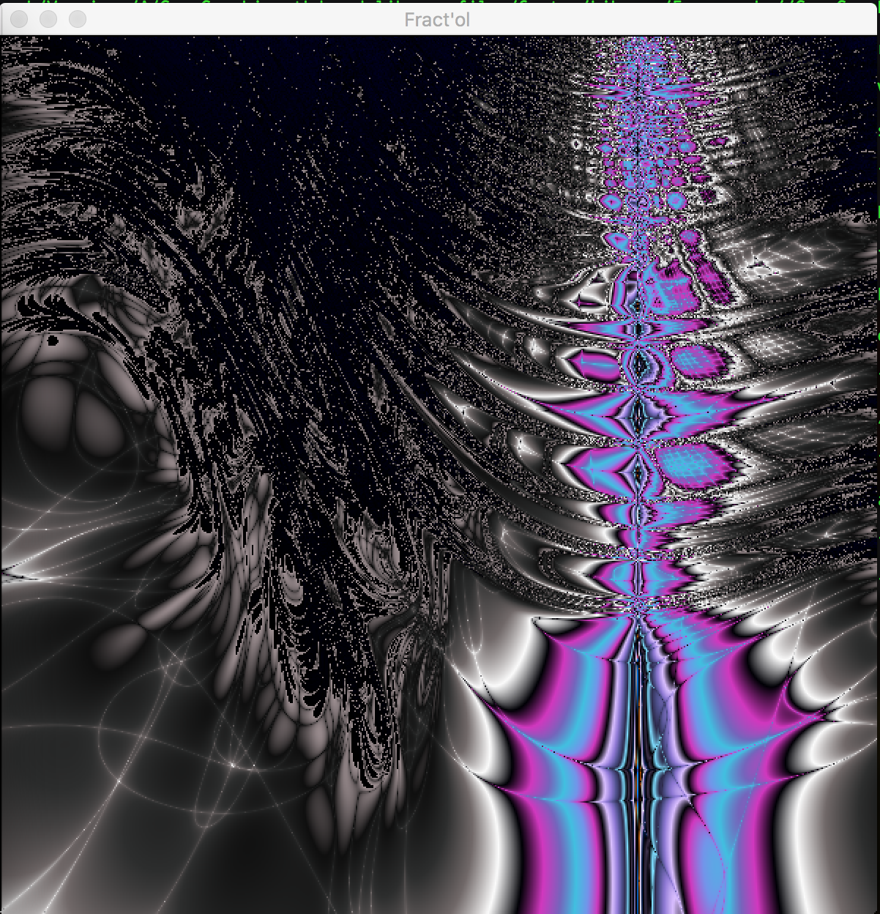

# Fract'ol
Fractal Renderer - 42 Graphic branch project 



# Built & Use

+ C 
+ MLX Library
+ Runs on OS X and Linux.
+ Multithread

```
make && ./fractol [julia, mandelbrot, tribrot, burningship, lyapunov]
```



# Features

* Smooth linear coloring
* Different color schemes
* Mouse + Pad zoom
* Move


# Bonus fractal : Lyapunov
  * only sequence change available
 



